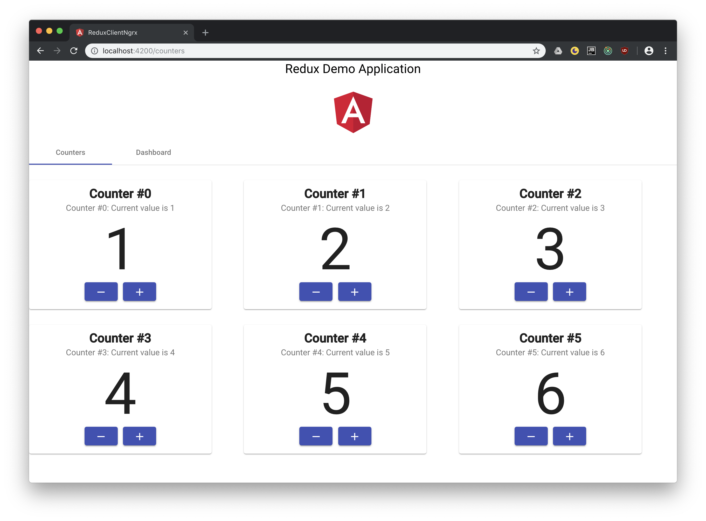

# Angular NgRx Client

This is a single-page application written in TypeScript using Angular 7. It
retrieves counters from a REST service and displays them. You can increase and
decrease each counter's value. A second page displays a little dashboard that
does some analytics on your counters and their values.

## Purpose

I wanted to learn more about the Redux architectural pattern to solve common
problems like the same data being used in multiple components. Changes in one
component would not update the other component's data, so one would either have
to deal with this chaos or notify the other components about change with e. g.
events. This is complicated, error-prone and very ugly. Redux perfectly solves
this problem. So I wrote this app together with the server side which you can
find [here](https://github.com/MichaelKaaden/redux-server).

The app utilizes [NgRx](https://github.com/ngrx/platform). To see the same app
using [angular-redux](https://github.com/angular-redux/store), have a look at
[this](https://github.com/MichaelKaaden/redux-client-ng5.git) repository.

## Running `ng update`

It seems `ng update` is not fully compatible with Yarn. See
[this](https://github.com/angular/angular-cli/issues/11694) issue.

To mitigate this, use the `--from=x.x.x` syntax. Example:
`ng update --from=6.2.5 @angular/cli`.

## Some hints on using [@ngrx/schematics](https://github.com/ngrx/platform/blob/master/docs/schematics/README.md)

First, generate a store using `IAppState` as state interface:

    ng g store State --stateInterface IAppState --root --module app.module.ts

Then, create a set of actions, effects and reducers (called a _feature_) for the
error component:

    ng g feature error -m app.module.ts --group

## Development server

Run `ng serve` for a dev server. Navigate to `http://localhost:4200/`. The app
will automatically reload if you change any of the source files.
