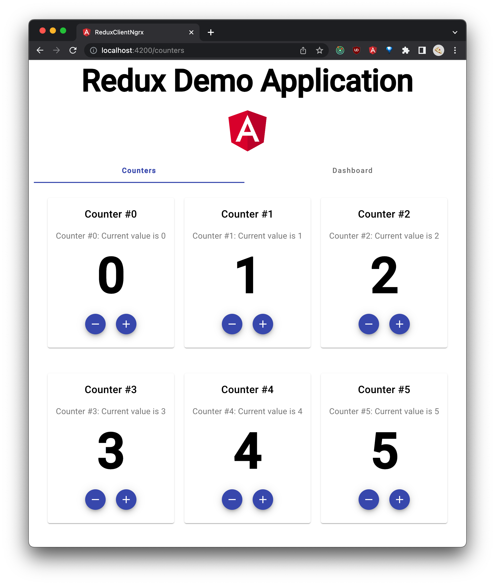

# Angular NgRx Client

[](https://github.com/MichaelKaaden/redux-client-ngrx/commits/master)
[](https://github.com/MichaelKaaden/redux-client-ngrx/releases)
[](https://github.com/MichaelKaaden/redux-client-ngrx/blob/master/package.json)
[](https://david-dm.org/MichaelKaaden/redux-client-ngrx)
[](https://david-dm.org/MichaelKaaden/redux-client-ngrx?type=dev)
[](https://github.com/MichaelKaaden/redux-client-ngrx/issues)
[](https://github.com/MichaelKaaden/redux-client-ngrx)

This is a single-page application written in TypeScript using Angular 7. It
retrieves counters from a REST service and displays them. You can increase and
decrease each counter's value. A second page displays a little dashboard that
does some analytics on your counters and their values.



## Purpose

I wanted to learn more about the Redux architectural pattern to solve common
problems like the same data being used in multiple components. Changes in one
component would not update the other component's data, so one would either have
to deal with this chaos or notify the other components about change with e. g.
events. This is complicated, error-prone and very ugly. Redux perfectly solves
this problem. So I wrote this app together with the server side which you can
find [here](https://github.com/MichaelKaaden/redux-server).

The app utilizes [NgRx](https://github.com/ngrx/platform). To see the same app
using [angular-redux](https://github.com/angular-redux/store), have a look at
[this](https://github.com/MichaelKaaden/redux-client-ng5.git) repository.

## What do you think of `@ngrx/entity`?

Well... `@ngrx/entity` makes it very easy to write reducers, and its performance
is very good. But it comes with two limitations you should consider:

-   Unit-testing becomes more tedious. You no longer can simply put your
    business objects inside your store. You have to create the matching
    `ids: [...], entities: {...}` instead. I made a little helper function for
    that:

    ```typescript
    export function initializeStateWith(counters: Counter[]): CountersState {
        const state: CountersState = adapter.getInitialState();
        const ids: number[] = [];
        const entities: Dictionary<Counter> = {};

        for (const counter of counters) {
            ids.push(counter.index);
            entities[counter.index] = counter;
        }

        state.ids = ids;
        state.entities = entities;

        return state;
    }
    ```

-   The second thing that hurts much more is: You cannot use classes as base for
    the things you put into the store. You have to use plain objects. That makes
    sense because of serialization, but on the other hand it isn't fun
    initializing objects where a simple constructor would do.

    If you _try_ to use classes, you'll stumble upon a problem: `updateOne(...)`
    as well as `updateMany()` _copy_ properties from one object into a new one.
    Problem is: You're now no longer dealing with instances of classes, but
    simple objects.

    Let's look at a piece of code:

    ```typescript
    export class Counter implements ICounter {
        public isLoading?: boolean;
        public isSaving?: boolean;

        constructor(public index: number, public value?: number) {}
    }

    const counter = new Counter(index, value);

    it("should return a counter out of the cache", () => {
        // prepare state to already have the counter loaded
        store.dispatch(new LoadPending({ index }));
        store.dispatch(new LoadCompleted({ index, counter }));

        const action = new LoadPending({ index });
        const completion = new LoadCompleted({ index, counter });

        const counterSpy = spyOn(counterService, "counter").and.returnValue(
            of(new Counter(index, value)),
        );

        actions$ = cold("--a-", { a: action });
        const expected = cold("--b", { b: completion });

        expect(effects.loadPending$).toBeObservable(expected);
        expect(counterSpy).not.toHaveBeenCalled();
    });
    ```

    The test will _fail_ at the first expectation with the message
    "`Expected $[0].notification.value.payload.counter to be a kind of Counter, but was Object({ index: 0, value: 42, isLoading: false }).`"

    As Mike Ryan says [here](https://github.com/ngrx/platform/issues/976), this
    behaviour is intentional.

Now it's your choice if you'll stick with implementing the state operations for
yourself until this has changed or if you still want to use @ngrx/entity.

## Unit Testing and Code Coverage

I tried to test as much as possible. The current code coverage is at almost
100%. The one thing missing is a test regarding the production environment which
shouldn't load the `storeFreeze` meta reducer. I consider this a minor problem,
though. ;-)


## Running `ng update`

It seems `ng update` is not fully compatible with Yarn. See
[this](https://github.com/angular/angular-cli/issues/11694) issue.

To mitigate this, use the `--from=x.x.x` syntax. Example:
`ng update --from=6.2.5 @angular/cli`.

## Some hints on using [@ngrx/schematics](https://github.com/ngrx/platform/blob/master/docs/schematics/README.md)

First, generate a store using `IAppState` as state interface:

    ng g store State --stateInterface IAppState --root --module app.module.ts

Then, create a set of actions, effects and reducers (called a _feature_) for the
error component:

    ng g feature error -m app.module.ts --group

## Development server

Run `ng serve` for a dev server. Navigate to `http://localhost:4200/`. The app
will automatically reload if you change any of the source files.
